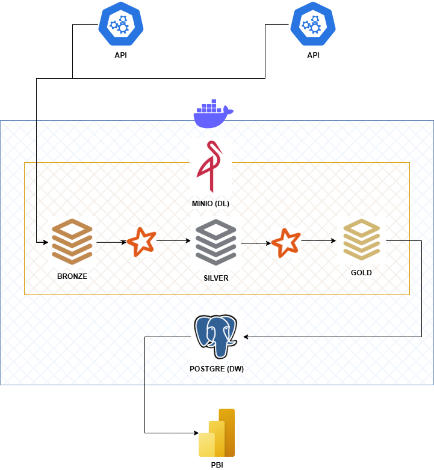

[README PT-BR](README.pt-br.md)


## Theme:
Development of a data engineering pipeline focused on the banking sector, using stock data from Santander, Itaú, and Microsoft. The project focuses on data ingestion and structuring of financial data to simulate both batch and streaming workflows. The main goal is to build a database that enables historical and near-real-time analysis, simulating real-world scenarios of a data engineering pipeline.


## Data Sources:
- Yahoo Finance API, in Pandas DataFrame format.
   - [Yahoo Finance API](https://ranaroussi.github.io/yfinance/) 


## Project Structure:
```
root_project/
│
├── docs/               # Project documentation, diagrams, specifications
│
├── notebooks/          # Exploration and testing notebooks
│
├── scripts/            # ETL scripts, functions, automation
│
└── README.md           # Project overview and instructions
```


## Architecture:
1. **Data Sources**
   - Yahoo Finance API (Santander, Itau)
   - Alpha Vantage API (Microsoft)
2. **Data Ingestion**
   - APIs run in Docker containers.
   - Data goes straight to the Raw layer(Local).
3. **Data Processing**
   - Data moves through layers: Raw(Local) → Bronze(MinIO) → Silver(MinIO) → Gold(MinIO).
   - Applies cleaning, transforming, and aggregating.
4. **Data Storage**
   - Gold layer is loaded into PostgreSQL.
5. **Data Analysis**
   - Power BI reads data from PostgreSQL for dashboards and reports.




## Oficial documentation resources:
This project uses the following tools and services:
- [Python](https://www.python.org/doc/) – Programming language for scripts, ETL, data transformation, and API integration.
- [Docker](https://docs.docker.com/get-started/) – Containerization platform to run isolated services (like MinIO and PostgreSQL).
- [MinIO](https://docs.min.io/enterprise/aistor-object-store/) (via Docker) – Object storage used as a local data lake to store raw (Bronze), cleaned (Silver), and aggregated (Gold) data layers.
- [Postgres](https://www.postgresql.org/docs/) (via Docker) - Relational database used to store Airflow metadata and data warehouse tables for the Gold layer, keeping track of workflow states and aggregated, cleaned data.
- [Apache-Airflow](https://airflow.apache.org/docs/) (via Docker) - Workflow orchestrator to manage, schedule, and monitor ETL pipelines, making tasks run in the right order and keeping data processing automated.
- [Apache-Spark](https://archive.apache.org/dist/spark/docs/3.4.1/) (via Docker) - A distributed processing engine used to run transformations on large data volumes quickly and at scale, integrating with Python via PySpark for ETL pipelines and data processing.


## Docker hub images documentation:
- [MinIO](https://hub.docker.com/r/minio/minio)
- [Postgres](https://hub.docker.com/_/postgres)
- [Apache-Airflow](https://hub.docker.com/r/apache/airflow)
- [Apache-Spark](https://hub.docker.com/r/apache/spark)


## Useful Tools:
- [Gitignore Generator](https://www.toptal.com/developers/gitignore/) – Tool to generate `.gitignore`.